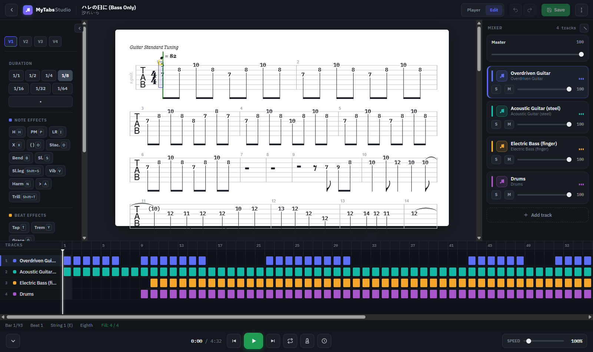
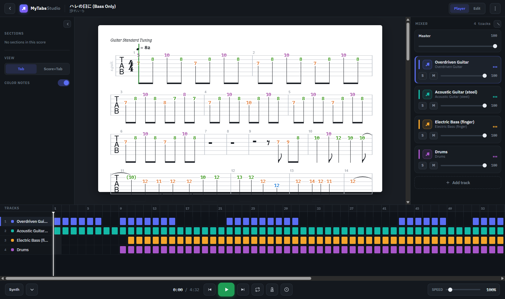

<div align="center" width="100%">
    
</div>

# TabCraft Studio

<sub>formerly / repository name: **It's MyTabs**</sub>

<a target="_blank" href="https://github.com/federicocunico/its-mytabs"></a>
<a target="_blank" href="https://github.com/federicocunico/its-mytabs"></a>

Open source, web based, self hostable guitar/bass tab player and editor with a Guitar-Pro-style studio interface, similar to Songsterr.

> **Naming.** The redesigned product is called **TabCraft Studio** — this is the name and icon shown throughout the UI. The project keeps its original name **It's MyTabs** as the repository name and
> historical reference.
>
> This is a fork of [louislam/its-mytabs](https://github.com/louislam/its-mytabs). It runs entirely from this repository's source — build the Docker image or run it with Deno as shown below (there is
> no prebuilt image or release download to pull).



## Features

- Free and open source (MIT License)
- Supports guitar tabs and bass tabs
- **Studio editor** — a Guitar-Pro-style app shell; opening a tab lands straight in the editor:
  - Top bar with song info, key / tempo / time-signature badges and a **Tab / Score / Score + Tab** view switch, a **color-notes** toggle and a **keyboard-shortcuts** button
  - The notation always renders on a **white sheet**, in a shell that follows your **light / dark** theme preference
  - **Docked mixer** (right rail): per-track solo / mute / volume, master volume, track colors; the selected track is highlighted
  - **Multi-track bar navigator** (bottom): one row per track, colored blocks where each track plays, section lane, playhead — click any bar to jump there
  - Docked transport: play/pause, to start/end, loop, metronome, count-in, speed slider, time readout
  - Every panel is collapsible and resizable (layout persists across reloads)
- **Score editing** — edit tabs right in the browser (notes, rests, durations, effects, bars, tracks, tunings) with full keyboard shortcuts, undo/redo, and save back to the server as .gp — including
  percussion / drum tracks
- Sync your tabs with audio files (.mp3, .ogg) or Youtube videos
- MIDI Synth - able to mute tracks and solo tracks
- Supports .gp, .gpx, .gp3, .gp4, .gp5, .musicxml, .capx formats
- Instruments identified from their General MIDI program (drums detected by the drum channel)
- Mobile friendly
- Notes coloring (string → color coding on the sheet), toggled from the top bar
- Per-tab display preferences (view mode + color notes) persist across reloads
- Able to share tabs with others with a link

## Run

This fork is run from source. Clone the repository first:

```bash
git clone https://github.com/federicocunico/its-mytabs.git
cd its-mytabs
```

Support: x64, ARM64. Tip: Youtube videos may not work on a private ip address (e.g. 192.168.x.x), use `localhost` or a public ip/domain instead.

### Docker Compose (recommended)

The bundled [`compose.yaml`](./compose.yaml) builds the image from the current source — no prebuilt image is pulled.

```bash
docker compose up --build       # build + run in foreground
# or
docker compose up --build -d    # build + run in background
```

Your tabs are stored in `./data` (mounted into the container). Go to `http://localhost:47777` to access the web UI.

### Docker (without compose)

```bash
docker build -t its-mytabs:local .
docker run -d --name its-mytabs -p 47777:47777 -v its-mytabs:/app/data --restart unless-stopped its-mytabs:local
```

Go to `http://localhost:47777` to access the web UI.

### Deno (no Docker) (Linux/Windows/MacOS)

Requirements: [Deno](https://deno.land/) 2.4.4+ and Git.

```bash
deno task setup   # install deps + build the frontend
deno task start   # start the server
```

Go to `http://localhost:47777` to access the web UI. For a hot-reloading dev environment, see [Development](#development).

## Screenshots

**Player** — white score sheet, sections, docked mixer, multi-track bar navigator and transport:



**Editor** — tool palette with keyboard-shortcut hints, voice switch, live validation and the same mixer/navigator:


## Environment Variables

You can create a `.env` file to use these env vars.

```ini
# (string) Server Host (Default: not set, bind to all interfaces)
MYTABS_HOST=

# (string) Server Port (Default: 47777)
MYTABS_PORT=47777

# (boolean) Whether to launch the browser when starting the app (Desktop only) (Default: true)
MYTABS_LAUNCH_BROWSER=true
```

## User Guide

See **[docs/user-guide.md](docs/user-guide.md)** for the full guide — playing tabs, audio sync, settings, score editing, keyboard shortcuts, sharing, and more.

## Motivation

A few months ago, I saw a music game called Rocksmith 2014 Remastered on sale on Steam. I bought it, grabbed my brother's abandoned bass, and started playing.

I had 100+ hours in the game, and I loved it. However, I started to realize that I was just following the screen and hitting notes, I cannot actually do anything outside the game. So I decided to
actually learn to play bass, learn how to read the tab.

So I found many tools online such as `MuseScore`, `Soundslice`. Eventually, I subscribed to `Songsterr`, I absolutely love it, especial for its UI/UX. However, it is not perfect, many songs don't sync
with youtube/audio source correctly, the cursor is confusing due to out-fo-sync issues. There is no manual sync feature. I have also looked into other tools like Soundslice, Guitar Pro 8, which offer
sync tools, but they are hard to use. Since most of my favourite songs follow the bpm perfectly, I just want something that able to sync the first bar, and good to go.

Plus, I am not a fan of subscription models.

After searching, I could not find any open source projects that is similar to `Songsterr`, so I decided to make one for myself to learn bass.

Don't forget to ⭐ this repo if you like it!

## Side Notes

The demo tab Hare no Hi ni (ハレの日に) by Reira Ushio (汐れいら), which is the ending song from the anime "The Fragrant Flower Blooms with Dignity" (薫る花は凛と咲く).

Beautiful song, and I love the bass line.

It was AI generated on Songsterr, and the bass tab was inaccurate, so I fixed it by my ear.

Since I am a beginner, I re-arranged some parts (fewer slide) to make it easier to play. Hope you enjoy it too.

Reddit post: https://www.reddit.com/r/selfhosted/comments/1nuisjc/i_built_a_selfhosted_guitarbass_tab_player

## Free Resources

- [Ultimate Guitar](https://www.ultimate-guitar.com/) - Some free tabs in *.gp format

- [911Tabs](https://www.911tabs.com/) - Search engine for tabs
- [MuseScore (Free Download filtered)](https://musescore.com/sheetmusic?instrument=72%2C73&recording_type=free-download) - Some free tabs in MusicXML format
- [GProTab](https://gprotab.net/) - Free Guitar Pro tabs in *.gp format

## Special Thanks

- [AlphaTab](https://github.com/CoderLine/alphaTab) by [Daniel Kuschny](https://github.com/Danielku15) - The tab rendering engine

## Development

- Install [Deno](https://deno.land/) 2.4.4+
- Install [make](https://www.gnu.org/software/make/) (optional; Git for Windows includes it)

```bash
make dev    # install deps, build frontend, start backend + Vite concurrently
make build  # install deps + production frontend build
```

**Dev URLs:** backend `http://localhost:47777` · Vite HMR `http://localhost:5173` (use the Vite URL while developing). Stop Docker or anything else on port 47777 before `make dev`.

Or with deno tasks:

```bash
deno install
cd frontend && deno install

# Start development server (Hot Reload enabled)
deno task dev
```
